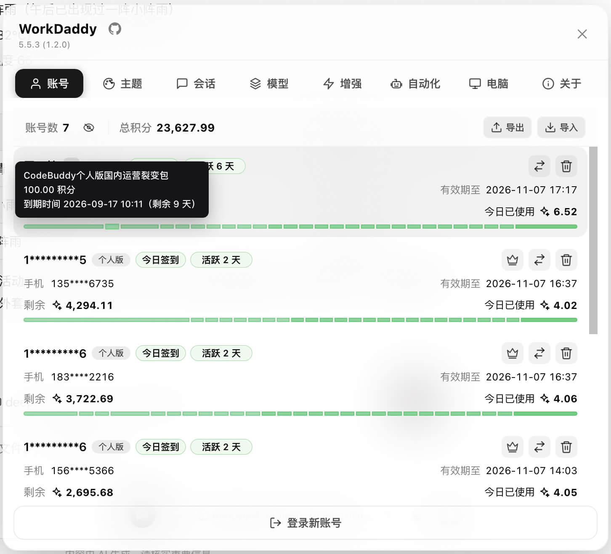
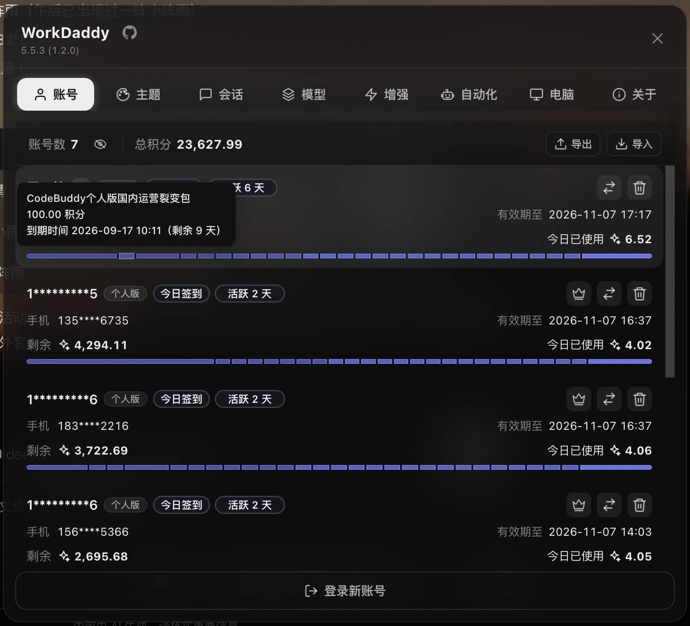
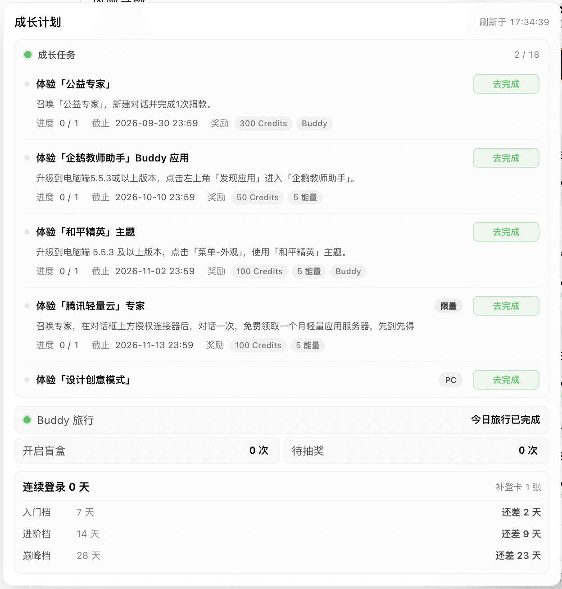
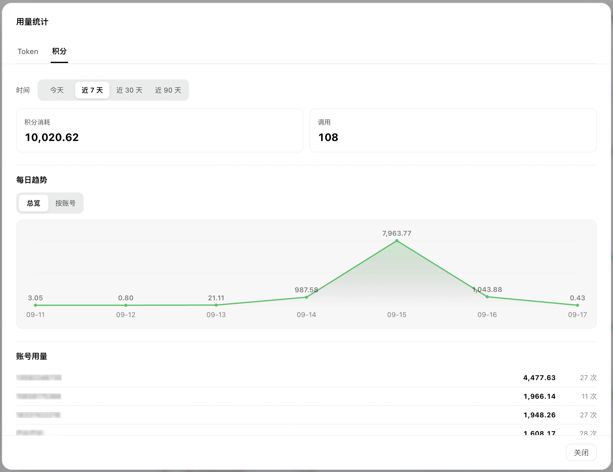
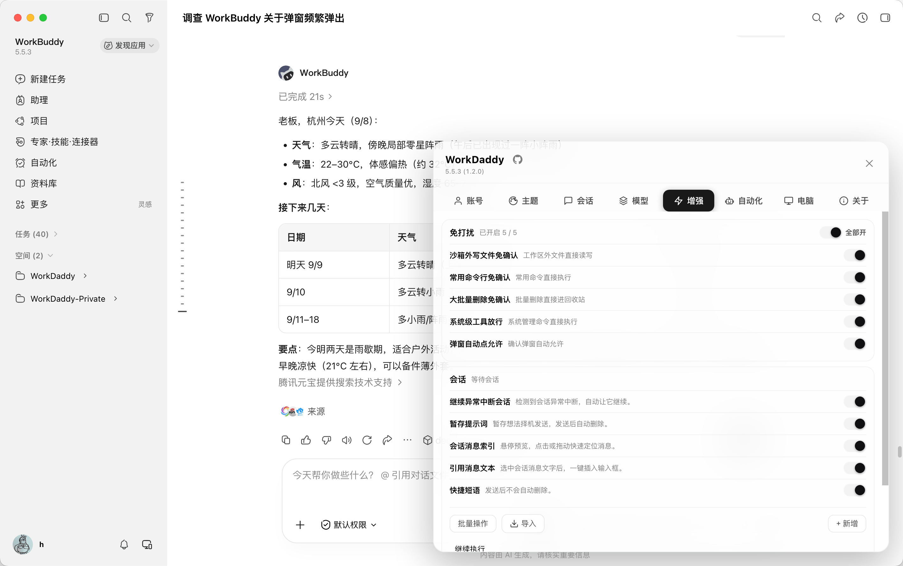
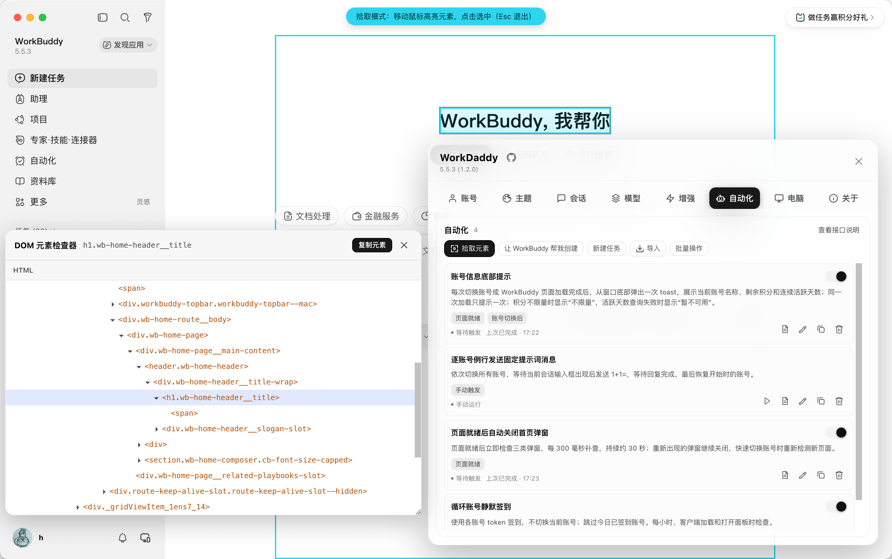
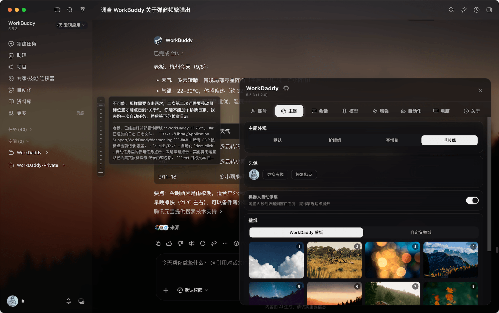
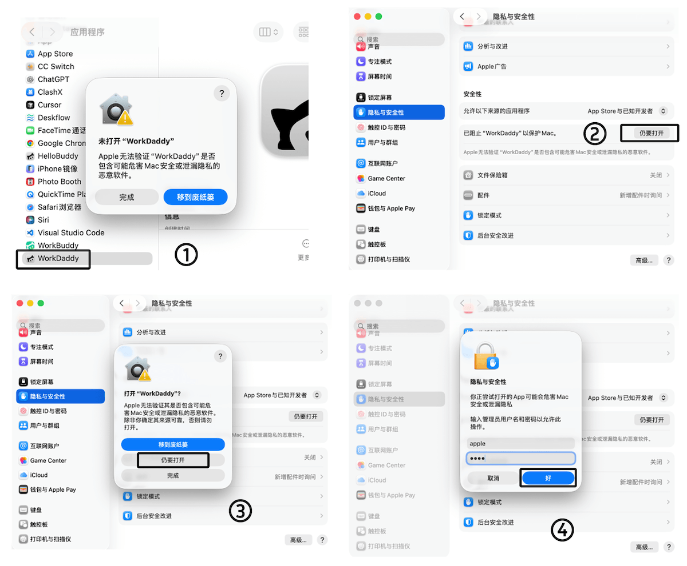

<h1>  WorkDaddy</h1>

**Language:** [简体中文](README.md) · [English](README_en.md)

> **WorkDaddy / CodeDaddy enhance WorkBuddy and CodeBuddy desktop clients with separate account backups, account switching, session migration, model management, and automations. WorkBuddy also supports quiet approvals, auto-continue, prompt stashing, quick phrases, and five themes. Accounts and configuration stay on your computer.**
> Local loopback CDP injection · the official installation is never modified.

A desktop enhancement tool for [WorkBuddy](https://www.workbuddy.cn/), [WorkBuddy AI](https://www.workbuddy.ai/), [CodeBuddy CN](https://www.codebuddy.cn/), and [CodeBuddy](https://www.codebuddy.ai/), built on **Chrome DevTools Protocol (CDP)**.
CodeBuddy support targets its **Electron agent window**, not the VS Code editor mode. Local debugging interfaces connect to the running client without modifying its official installation or signature.


---

## Clients and feature scope

| Official client | Package brand | Profile |
| --- | --- | --- |
| WorkBuddy mainland | WorkDaddy | `workbuddy-cn` |
| WorkBuddy AI international | WorkDaddy AI | `workbuddy-ai` |
| CodeBuddy CN mainland (Electron) | CodeDaddy CN | `codebuddy-cn` |
| CodeBuddy international (Electron) | CodeDaddy | `codebuddy-intl` |

- Note: CodeBuddy does not show the Enhance page; its Theme page only provides floating robot settings.

## Preview












---

## What it does

- **Fast account switching:** each client keeps separate account backups, so you can switch without scanning a QR code every time.
- **Add an account without quitting:** authorize through OAuth in your browser while WorkBuddy stays open. The new account joins the list automatically. A traditional soft logout flow is also available.
- **Encrypted account import/export:** move account backups between computers using a password-protected file.
- **Growth and activity:** mainland editions show growth-task progress, daily check-in and activity status, consecutive active days, and Buddy unlock and travel status.
- **Token and credit usage pages:** review daily token and credit consumption, filter by account, and view usage rankings by model and account.
- **Credit-aware account suggestions:** when an account is running low on credits, WorkDaddy suggests another account you can use.
- **Model rate limits and reset estimates:** when a model rate limit is detected, the Accounts page shows the affected model and its estimated reset time. If no reset time is provided, it displays “Time unknown.”
- **Automation tasks:** discover and import tasks from public GitHub and Gitee repositories, or describe what you need and let WorkBuddy create a task. Supports manual, event, and scheduled triggers, run logs, stopping tasks, and JSON / ZIP export.
- **Quiet approval mode:** automatically handle supported permission prompts while you are away.
- **Stash prompts:** send drafts to WorkBuddy's pending message queue while preserving images, files, and quotes for later use.
- **Themes:** WorkBuddy’s Manage theme switch offers Light, Dark, Eye-care green, Cyber purple, and Frosted glass. Frosted glass supports preset and custom wallpapers; turning management off restores the client’s native appearance.
- **Session migration:** copy sessions between accounts automatically or manually and continue working where you left off.
- **Session branching:** once enabled under Enhance, any reply can start a new conversation that keeps the chat up to that reply, while the original conversation stays untouched.
- **Model tools:** manage and switch models more easily, including multiple configurations with the same model name.
- **Sleep control:** keep the computer awake while AI tasks run, then allow normal sleep when they finish.
- **Auto-continue:** automatically continue tasks interrupted by network fluctuations, timeouts, or similar failures.
- **Quick phrases:** save common prompts in the panel and send them from the composer toolbar.

---

## Installation

Install and sign in to the official client first, then choose the matching package brand from the table above. All four packages have separate installations and account backup directories. Spaces in package names are written as hyphens.

### macOS

1. Download `WorkDaddy-x.y.z.dmg`, `WorkDaddy-AI-x.y.z.dmg`, `CodeDaddy-CN-x.y.z.dmg`, or `CodeDaddy-x.y.z.dmg` for your client from [Releases](../../releases).
2. Open the DMG and drag the app into **Applications**.
3. If macOS says Apple cannot check the app for malicious software:
   1. Open **System Settings → Privacy & Security**.
   2. Find the blocked WorkDaddy app and choose **Open Anyway**.
   3. Confirm with your login password.
      
4. Launch the matching WorkDaddy / CodeDaddy app. It starts its local daemon and injects the panel into your client. The macOS launcher uses your local Node.js installation; Node.js 22.13 or newer is recommended.
5. Once the robot button appears, you are ready to go.

#### Enterprise / VPC clients

On macOS, WorkDaddy scans apps whose names start with `WorkBuddy` and that contain `Contents/MacOS/Electron`, such as `WorkBuddy企业定制版.app`. It filters candidates by the WorkDaddy or WorkDaddy AI profile. If several clients match, a system picker lets you choose one and remembers your selection. No manual configuration file lookup is needed. For an app with a completely custom name, run this advanced configuration command from the source directory:

```bash
node scripts/workbuddy-target.js --configure --platform darwin \
  --profile workbuddy-cn \
  --binary "/Applications/Enterprise Client.app/Contents/MacOS/Electron" \
  --data-dir "$HOME/Library/Application Support/WorkDaddy"
```

### Windows

1. Download `WorkDaddy-Setup-x.y.z.exe`, `WorkDaddy-AI-Setup-x.y.z.exe`, `CodeDaddy-CN-Setup-x.y.z.exe`, or `CodeDaddy-Setup-x.y.z.exe` for your client from [Releases](../../releases).
2. Run the installer.
3. Launch the matching brand from its desktop shortcut.

#### Windows portable ZIPs

Use the matching `<brand>-Portable-x.y.z.zip`, where `<brand>` is `WorkDaddy`, `WorkDaddy-AI`, `CodeDaddy-CN`, or `CodeDaddy`. Extract it to a writable directory, then run `Start-WorkDaddy.cmd` or `WorkDaddyLauncher.exe`. Run `Stop-WorkDaddy.cmd` before replacing it with a newer ZIP.

Portable packages do not create shortcuts or uninstall entries. Backups remain under the current user’s `%APPDATA%\WorkDaddy`, not inside the ZIP. Do not run installed and portable copies of the same profile together. Portable editions do not use the panel’s installer updater.

#### Enterprise / VPC clients

Install the WorkDaddy or WorkDaddy AI edition that most closely matches your client's interface. The installer detects the corresponding official client and shows its path and version. Enterprise users can choose **Browse** to select their own `.exe`; no configuration files or environment variables need to be edited.

The selection is saved in WorkDaddy's personal data directory and preserved during updates. Run the installer again to change it or return to the detected official client. WorkDaddy pins the selected client version, so use the installer to confirm the client again after it is upgraded or moved.

### Linux

Ubuntu / Debian packages are available for `amd64` and `arm64`, with a matching Node.js runtime included. Install and sign in to the official client for the same architecture first.

| Brand | DEB file | Installation directory / Debian package name |
| --- | --- | --- |
| WorkDaddy | `WorkDaddy_x.y.z_<arch>.deb` | `/opt/workdaddy` / `workdaddy` |
| WorkDaddy AI | `WorkDaddy-AI_x.y.z_<arch>.deb` | `/opt/workdaddy-ai` / `workdaddy-ai` |
| CodeDaddy CN | `CodeDaddy-CN_x.y.z_<arch>.deb` | `/opt/codedaddy-cn` / `codedaddy-cn` |
| CodeDaddy | `CodeDaddy_x.y.z_<arch>.deb` | `/opt/codedaddy` / `codedaddy` |

1. Download the matching file from [Releases](../../releases), choosing `amd64` or `arm64` for `<arch>`.
2. Install it from your download directory, for example:

   ```bash
   sudo apt install ./CodeDaddy-CN_1.2.9_amd64.deb
   ```

3. Launch the matching brand from the application menu and follow the instructions to enable CDP. For CodeBuddy, open its Electron agent window.

All four packages can coexist and do not enable login autostart by default. Without an application menu, use the matching entry point:

```bash
bash /opt/workdaddy/scripts/launch-gui-linux.sh cn
bash /opt/workdaddy-ai/scripts/launch-gui-linux.sh ai
bash /opt/codedaddy-cn/scripts/launch-gui-linux.sh codebuddy-cn
bash /opt/codedaddy/scripts/launch-gui-linux.sh codebuddy-intl
```

Optionally enable a systemd user service for your profile, for example:

```bash
WBSWITCH_PROFILE=codebuddy-cn bash /opt/codedaddy-cn/scripts/systemd-install-linux.sh
```

Uninstall with `sudo apt remove <package-name>`. Account backups and runtime data under `~/.config/WorkDaddy` are retained. Linux does not currently support updates from the panel; install the newer DEB to upgrade.

For Linux source installation, use `scripts/install-linux.sh` and `scripts/relaunch-with-cdp-linux.sh` with the appropriate `WBSWITCH_PROFILE`. WorkBuddy AI can use `scripts/workbuddy-ai-linux.sh install` and `scripts/workbuddy-ai-linux.sh relaunch` for its isolated environment. Set `WBSWITCH_WORKBUDDY_BIN=/path/to/client` when you need to select a client executable explicitly.

### Run from source (developers)

```bash
git clone https://github.com/babygoton/WorkDaddy.git
cd WorkDaddy
bash scripts/install.sh           # Create the backup directory and start the daemon
bash scripts/relaunch-with-cdp.sh  # Launch WorkBuddy with CDP on port 9222
```

All four clients share the same daemon code. Profiles bind it to the intended client rather than guessing from the first available CDP port:

```bash
WBSWITCH_PROFILE=workbuddy-cn bash scripts/relaunch-with-cdp.sh
WBSWITCH_PROFILE=workbuddy-ai bash scripts/relaunch-with-cdp.sh
WBSWITCH_PROFILE=codebuddy-cn bash scripts/relaunch-with-cdp.sh
WBSWITCH_PROFILE=codebuddy-intl bash scripts/relaunch-with-cdp.sh
```

The release scripts build four DMGs for macOS, four DEBs per architecture for Linux, and a Setup.exe plus a Portable ZIP per client for Windows. Available downloads depend on the assets attached to each [Release](../../releases).

```bash
WORKDADDY_BUILD_VERSION=1.2.9 bash scripts/build-mac-dmg.sh
WORKDADDY_BUILD_VERSION=1.2.9 WORKDADDY_BUILD_ARCH=amd64 bash scripts/build-linux-deb.sh
WORKDADDY_BUILD_VERSION=1.2.9 WORKDADDY_BUILD_ARCH=arm64 bash scripts/build-linux-deb.sh
```

For macOS, use `WORKDADDY_BUILD_PROFILE` with any profile from the table above to build a single client. Windows Portable ZIPs are usable release downloads; `*-win64.zip` files are temporary installer build inputs.

`install.sh`:

- Creates the backup directory at `~/Library/Application Support/WorkDaddy`.
- Migrates legacy backups from `~/Library/Application Support/HelloBuddy/accounts` on first launch, preserving the old directory.
- Backs up the currently signed-in WorkBuddy account.
- Removes old launchd registrations and starts the daemon manually; it no longer starts automatically at login.
- Starts the background daemon immediately.
- Opens the management interface at `http://127.0.0.1:47832`.

> The installer starts the daemon once. After that, launch the appropriate WorkDaddy app when you need it.

---

## How it works

**CDP injection · the official installation is never modified**

```text
┌─────────────┐  --remote-debugging-port=9222  ┌──────────────┐
│  WorkBuddy  │ <───────────────────────────> │  WorkDaddy   │
│  (Electron) │       Chrome DevTools         │  daemon.js   │
│             │       Protocol (CDP)         │              │
│  Renderer   │  ←── Runtime.evaluate ────    │  HTTP :47832 │
│  Bottom     │      inject.js               │  Local API   │
│  right      │                              │              │
└─────────────┘                              └──────────────┘
```

The diagram uses mainland WorkBuddy as an example. In the profile order shown above, local API ports default to `47832`, `47833`, `47834`, and `47835`; renderer CDP ports default to `9222`, `9223`, `9224`, and `9225`. CodeBuddy additionally uses local main-process debugging ports `9244` / `9245` for native authentication and session storage.

1. **Unmodified WorkBuddy binaries:** the launcher adds `--remote-debugging-port=9222` when starting WorkBuddy. Its binary and signature remain intact.
2. **CDP connection:** the daemon watches login and authentication network events, with a file watcher as a fallback. Login and token refresh events back up the current account to a stable local directory using `account.uid`.
3. **Injected UI:** `Runtime.evaluate` runs `inject.js` in the renderer, adding the robot button and the Accounts, Theme, Sessions, Models, Enhance, Automation, Computer, About, and Settings pages according to client capabilities. CodeBuddy hides Enhance.
4. **Local HTTP API:** the daemon listens on `127.0.0.1:47832`. The panel uses it for account switching, themes, check-ins, permission prompts, sleep control, and other features.
5. **Data boundaries:** account backups and configuration stay local. Login and credit features call the corresponding client’s official APIs; update checks call GitHub Releases. Explicit model connectivity tests send requests and the corresponding API key to the model service you configured. Redacted error diagnostics are enabled by default and can be turned off in **About**.

> Why CDP instead of an official plugin system? It connects directly to the running app, detects authentication changes, and injects the panel and style patches. WorkBuddy updates generally remain compatible as long as its interface does not change substantially.

---

## Usage

### Panel

Click the robot button in the lower-right corner of WorkBuddy or the CodeBuddy Electron window and choose a tab:

| Tab            | Purpose                                                                                                                                   |
| -------------- | ----------------------------------------------------------------------------------------------------------------------------------------- |
| **Accounts**   | View account counts, credits, model rate limits and estimated reset times, daily check-in status, consecutive active days, growth progress, and Buddy travel status; switch, delete, or add accounts; import/export encrypted backups               |
| **Theme**      | WorkBuddy: manage five themes, wallpapers, avatars, blur, and overlays. CodeBuddy: black or white floating robot settings     |
| **Sessions**   | Filter by account and date, copy or delete in bulk, and configure automatic session or workspace copying when switching accounts          |
| **Models**     | Manage current and alternative models, including backups, copying, editing, enabling, connectivity tests, and bulk deletion               |
| **Enhance**    | Configure quiet approvals, auto-continue, session branching, prompt stashing, and quick phrases                                                              |
| **Automation** | Discover and import tasks from public repositories, create and manage tasks, configure event or scheduled triggers, inspect run logs, stop running tasks, and export JSON or ZIP files |
| **Computer**   | Allow or prevent sleep, or restore normal sleep after all AI tasks finish                                                                 |
| **About**      | View version and project information, check for and install updates, and control redacted error diagnostics                               |
| **Settings**   | Choose Chinese or English; the first launch follows the system language and falls back to English                                         |

**Composer tools (WorkBuddy / WorkBuddy AI only):** enable **Stash prompts** and **Quick phrases** separately in **Enhance** to show their composer toolbar buttons. Stashing adds the current draft to WorkBuddy's own message queue with text, images, files, and quotes **preserved**, and pauses automatic sending. The composer is then cleared. Queued content is kept per conversation and can be sent, edited, or deleted. Quick phrases can be created, edited, and managed in bulk in Enhance, then sent from the composer toolbar; sending does not delete them.

### Automation

Save repetitive actions as tasks: daily check-ins, account credit queries, conditional reminders, or sending a message in a specific conversation and waiting for a reply.

1. Open **Automation** and use **Discover tasks** to browse tasks published in public repositories, or **Create with WorkBuddy** to describe what you need. WorkBuddy generates the task in a new conversation and adds it to the list when finished. You can also use **New task** to edit the step JSON yourself; **View capabilities** lists the currently supported operations.
2. Choose a trigger: run manually, or respond to events such as client loading, panel opening, page readiness, and account switching. Schedules support intervals, daily, weekly, monthly, and a specific date and time.
3. Enable, disable, edit, or copy tasks from the list. Manual tasks can run immediately; event and scheduled tasks run according to their configuration. Stop a running task when needed and inspect **Run logs** for results and failed steps.

**Import and export:** import tasks from public repositories through **Discover tasks**. Imported tasks remain disabled, existing tasks with the same ID are not overwritten, and incompatible tasks show the reason. Use bulk actions to select tasks for export: one task produces a JSON file, while multiple tasks produce a ZIP for backup or sharing.

Task definitions are stored locally and executed by the WorkDaddy daemon. Scheduled and event triggers require the daemon to remain running; steps that interact with a page also require the corresponding WorkBuddy client to be available. Task exports exclude account backups and run logs. The Automation page does not import local JSON or ZIP files.

#### Submit public tasks

**Discover tasks** lists tasks from public GitHub and Gitee repositories. See [`babygoton/workdaddy-official-plugin`](https://github.com/babygoton/workdaddy-official-plugin) for the recommended layout:

1. Clone the example repository and remove the sample tasks you do not need.
2. Put your task JSON files in the `tasks/` directory (up to 1 MiB per file, up to 200 tasks per repository).
3. Commit and push to GitHub or Gitee.
4. Add the keyword `WorkDaddyAutomationRepository` to the repository description.

Repositories that follow this convention appear in **Discover tasks** after the next refresh (search results are cached for 10 minutes). Importing only reads the file and runs compatibility checks; imported tasks stay disabled and existing tasks with the same ID are not overwritten.

### Move accounts to another computer

Use **Export** and **Import** at the top-right of the Accounts page:

1. On the old computer, open WorkDaddy, choose **Export**, and save the generated `WorkDaddy-账号导出-YYYY-MM-DD.json` file.
2. Transfer it securely to the new computer and install and launch WorkDaddy there.
3. Choose **Import** on the Accounts page and select the file. The restored accounts will be available in the account list.

Current exports use your password, a fresh random salt, and AES-256-GCM encryption. The password is not stored in the export. The encrypted file still contains tokens that can restore login sessions, so protect it like a password and remove unneeded copies after migration. Legacy v1 exports can still be imported.

## Security and privacy

- **Local data first:** account backups, themes, and local configuration are not uploaded in the background. Login and credit features access the corresponding client’s official APIs, and updates access GitHub Releases. Explicit model connectivity tests send requests and the corresponding API key to the third-party model service you configured.
- **Error diagnostics are enabled by default:** the **Send error diagnostics** switch in About controls both remote Sentry error reporting and local redacted renderer logs to help diagnose version and compatibility issues. Reports are redacted and truncated; remote reports exclude accounts, session contents, tokens, and API keys. Turn diagnostics off at any time in About, or use `WORKDADDY_TELEMETRY=0` / `1` as an explicit startup override.

A separate `SECURITY.md` may provide an expanded threat model; when it is not included, this section serves as the privacy and security overview.

---

## License and disclaimer

This project is licensed under the **[GNU Affero General Public License v3.0](LICENSE)** (`SPDX-License-Identifier: AGPL-3.0-or-later`).

- WorkDaddy / CodeDaddy provide local UI and usability enhancements for WorkBuddy and CodeBuddy and **are not affiliated with either official product**.
- WorkBuddy, CodeBuddy, their trademarks, and official assets belong to their respective owners. This project is not officially authorized or endorsed by either product.
- Third-party themes, wallpapers, and background images are provided for demonstration; check their rights before commercial use.

---

## Star History

<a href="https://www.star-history.com/?repos=babygoton%2Fworkdaddy&type=date&legend=top-left">
 <picture>
   <source media="(prefers-color-scheme: dark)" srcset="https://api.star-history.com/chart?repos=babygoton/workdaddy&type=date&theme=dark&legend=top-left" />
   <source media="(prefers-color-scheme: light)" srcset="https://api.star-history.com/chart?repos=babygoton/workdaddy&type=date&legend=top-left" />
   
 </picture>
</a>

---

## Community

[Linux.do](https://linux.do/)
